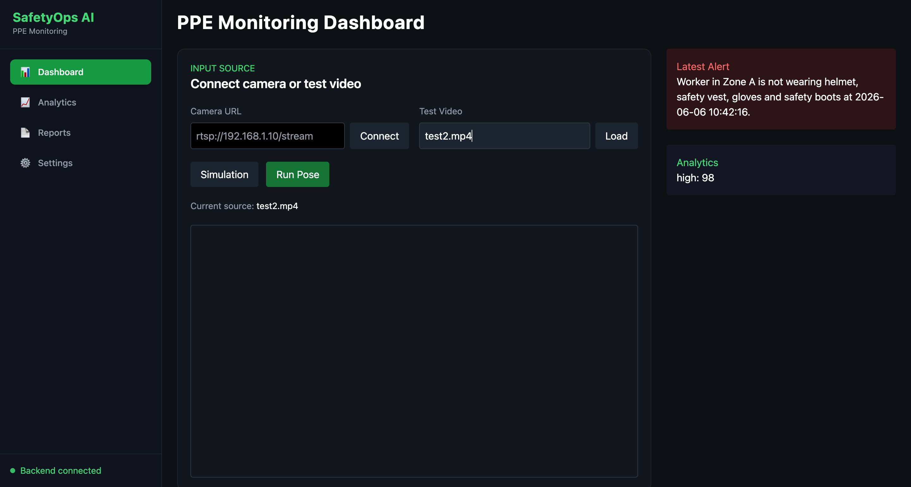

# 🦺 PPE Safety Monitoring System

An AI-powered workplace safety monitoring system that automatically detects Personal Protective Equipment (PPE) compliance, monitors worker activities, identifies restricted-zone violations, and visualizes worker movement in a 3D spatial environment.

---

## 📌 Overview

Industrial workplaces require strict adherence to safety protocols. Manual monitoring is often inefficient and prone to human error.

This project leverages Computer Vision, Pose Estimation, and Real-Time Analytics to monitor workers and detect safety violations automatically.

The system can:

* Detect PPE compliance in real-time
* Monitor worker pose using human keypoints
* Generate safety alerts
* Log violations into a database
* Display analytics dashboards
* Visualize workers in a 3D spatial environment
* Monitor restricted zones and room access

---

## 🚀 Features

### PPE Detection

* Helmet Detection
* Safety Vest Detection
* Gloves Detection
* Safety Boots Detection

### Human Pose Estimation

* 17-keypoint human skeleton tracking
* Real-time worker monitoring
* Pose-based worker visualization

### Violation Detection

* Missing Helmet
* Missing Vest
* Missing Gloves
* Missing Boots
* Restricted Zone Breach

### Analytics Dashboard

* Violation Statistics
* Event Logs
* Recent Alerts
* Live Monitoring Dashboard

### 3D Spatial Monitoring

* Worker Skeleton Visualization
* Factory Floor Representation
* Room-Based Restricted Zones
* Interactive Camera Controls

### Event Management

* Violation Logging
* Alert Generation
* Historical Event Tracking

---

# 🏗 System Architecture

```text
Video Feed
     │
     ▼
YOLO Pose Estimation
     │
     ▼
YOLO PPE Detection
     │
     ▼
Violation Detection Engine
     │
     ├── Event Logging
     ├── Alert Generation
     ├── Analytics Dashboard
     └── 3D Spatial Visualization
```

---

# 🛠 Tech Stack

## Backend

* Python
* FastAPI
* SQLite
* OpenCV
* Shapely

## AI Models

* YOLO Pose Estimation
* YOLO PPE Detection

## Frontend

* React.js
* Vite
* Tailwind CSS
* Three.js
* React Three Fiber

---

# 📷 Screenshots

## Dashboard



---

## PPE Detection


---

## Event Logs


---

## Analytics


---

## 3D Spatial Monitoring


---

## Restricted Zone Monitoring


---

# 📂 Project Structure

```text
PPE-Safety-Monitoring-System
│
├── api.py
├── ppe_main.py
├── ppe_nlp.py
├── event_log.py
│
├── safety-dashboard
│   ├── src
│   │   ├── components
│   │   ├── data
│   │   └── assets
│   │
│   ├── package.json
│   └── vite.config.js
│
└── README.md
```

---

# ⚙ Installation

## Clone Repository

```bash
git clone https://github.com/Mohitjain9654/PPE-Safety-Monitoring-System.git

cd PPE-Safety-Monitoring-System
```

## Backend Setup

```bash
pip install -r requirements.txt

python api.py
```

## Frontend Setup

```bash
cd safety-dashboard

npm install

npm run dev
```

---

# 🎯 Future Enhancements

* Multi-camera monitoring
* Worker identification and tracking
* Depth estimation
* Digital Twin integration
* Industrial IoT integration
* Real-time mobile notifications
* Advanced restricted-zone management

---

# 👨‍💻 Author

**Mohit Jain**

Final Year Project

Computer Science Engineering

---

# ⭐ Support

If you find this project useful, consider giving it a star on GitHub.
